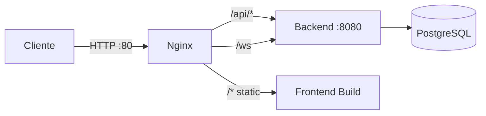

# Nginx Configuration - LEXIMATE

Esta configuración de nginx sirve como reverse proxy y servidor de archivos estáticos para la aplicación LEXIMATE.

## Arquitectura



## Configuración

### Rutas

1. **WebSocket (`/ws`)**
   - Proxy directo al backend en el puerto 8080
   - Configurado con soporte completo de WebSocket
   - Timeouts extendidos (3600s) para conexiones persistentes

2. **API (`/api/*`)**
   - Todas las rutas de API se proxean al backend
   - Timeouts aumentados a 300s para operaciones largas (ej. parsing de PDFs)
   - Headers de proxy correctamente configurados

3. **Frontend (`/*`)**
   - Servido desde `/usr/share/nginx/html` (montado desde el volumen `frontend_dist`)
   - Configurado con `try_files` para soporte de SPA (react-router)
   - Cache de 1 año para assets estáticos (js, css, imágenes, fuentes)

### Compresión

- **Gzip habilitado** para:
  - text/plain
  - application/json
  - text/css
  - application/javascript
- Tamaño mínimo para compresión: 1000 bytes

### Límites

- **client_max_body_size**: 50M (para uploads de archivos grandes)

## Docker Setup

### Volúmenes

```yaml
volumes:
  - ./nginx/nginx.conf:/etc/nginx/conf.d/default.conf:ro  # Configuración de nginx
  - frontend_dist:/usr/share/nginx/html:ro                # Archivos build del frontend
```

### Dependencias

El servicio nginx depende de:
- `backend`: API del servidor
- `frontend`: Build de la aplicación React

## Desarrollo

Para modificar la configuración:

1. Edita `nginx/nginx.conf`
2. Reinicia el contenedor de nginx:
   ```bash
   docker compose restart nginx
   ```

Para ver logs de nginx:
```bash
docker logs leximate-nginx -f
```

## Producción

En producción, considera:

1. **HTTPS**: Agregar certificados SSL/TLS
2. **Rate Limiting**: Proteger endpoints de API
3. **Security Headers**: Agregar headers de seguridad
4. **Access Logs**: Configurar logs de acceso detallados

### Ejemplo de configuración SSL

```nginx
server {
    listen 443 ssl http2;
    ssl_certificate /etc/nginx/ssl/cert.pem;
    ssl_certificate_key /etc/nginx/ssl/key.pem;
    
    # ... resto de la configuración
}

server {
    listen 80;
    return 301 https://$server_name$request_uri;
}
```
